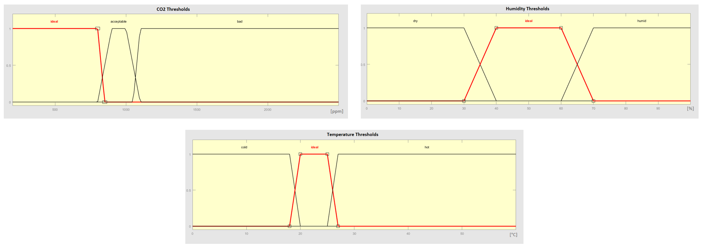
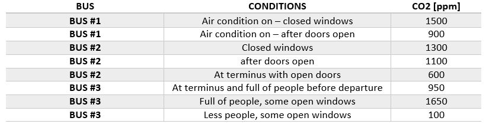
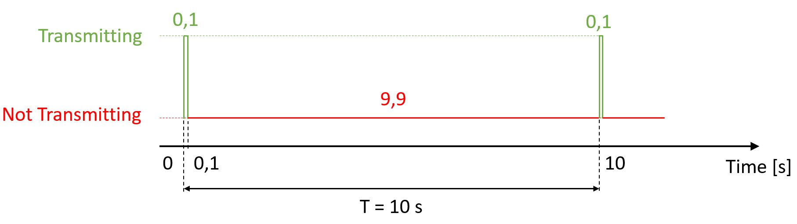
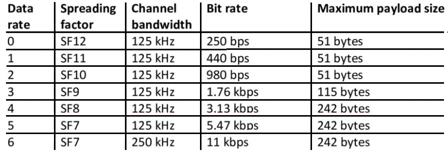
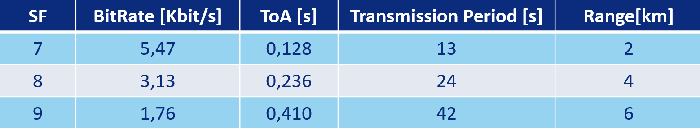
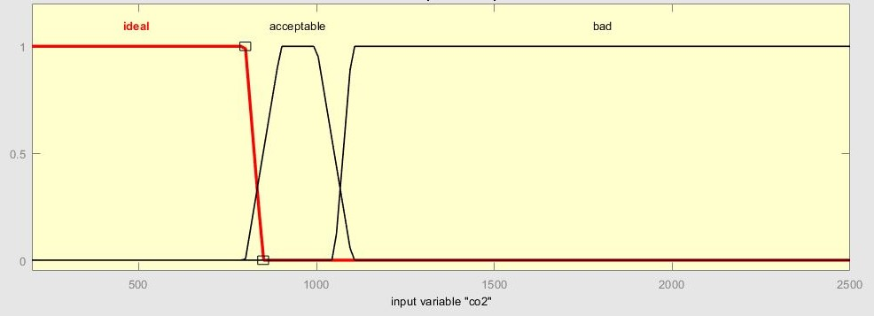
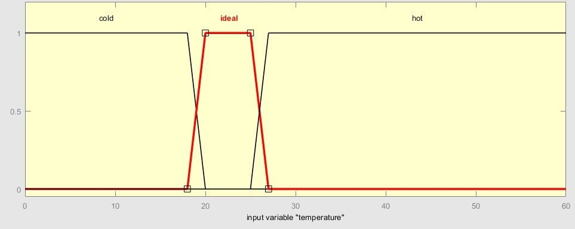
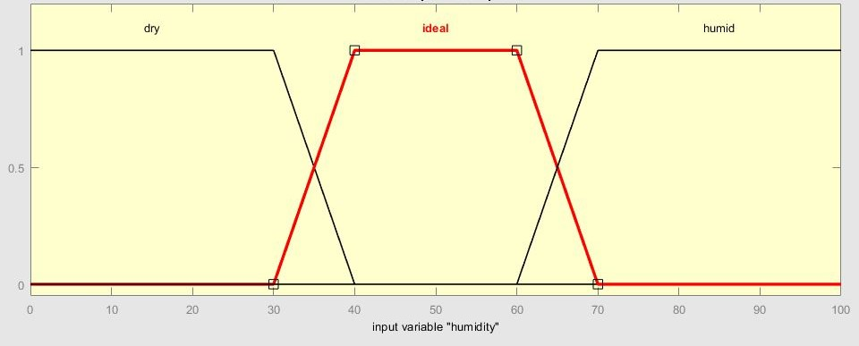
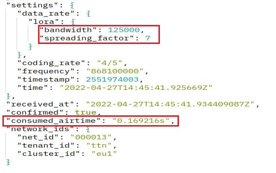
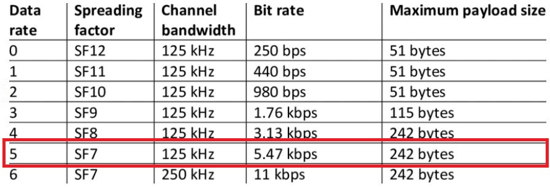

# Evaluation

## Requirements

- Interpretation of the collected data basedon some thresholds.
- The data have to be not older than 1 minute.
- Respect the LoRa DutyCylce constraint
- Guarantee security on the entire path.

## Indoor Parameters Levels

To have a better understing of the values collected by the sensors we had fixed some thresholds for each of the three parameters: Temperature, humidity and CO2 concentration. According to many studies the following values are the one considered ideal for the three parameters:

- Temperature: ideal range between 20 and 25 degree Celsius.
- Humidity: ideal range between 40 and 60 percent.
- CO2: ideal under 1100 ppm for idoor space.

    

We have collected CO2 concentration in three different bus and we ahve collected the most relevant values in the following table.

    

The concentration of CO2 inside the bus is the most of the time higher than 1100 ppm that according to our thresholds is the upper bound of the acceptable range. Only while stopped at the terminus with all the doors and windows opened we have registered a CO2 concentration on 600 ppm that is in the ideal range. We have understand, looking at our data, that the number of people inside the bus has a big impact on the CO2 concentration that is an expected behaviour since when we breathe out we produce CO2. Opening the windows and activating the air conditioning reduce the CO2 concentration but we were expecting a bigger impact of the air conditioning.

## Sampling Frequency

 The frequency with which our device can collect data and send them to the cloud is strictly related to the respect of the DutyCycle imposed by LoRa. In fact the LoRa specifications in Italy impose to respect a DutyCycle of 1%. Resepcting the DutyCycle of 1% means that if we need 0,1 seconds to send our data to the cloud then we need to wait for 9,9 seconds before to send fresh data.  
   In our case the data of transmission of the data is the Time on Air (ToA) of the LoRaWAN packets containing our data. The ToA corresponding to the time during which the channel is busy when sending a packet and it is strictly related to the Spreading Factor used to send the data. Given that the payload in our system is bigger than 60 bytes, according to the table on the right, we can use SF7, SF8 or SF9. As shown in the table as smaller the SF is, as higher is the data rate, but on the contrary smaller SF gives smaller range. We tested all those SF and we have tested the network statistics.  
   In order to collect the ToA for the different SF we have send messages with SF7, SF8 and SF9 and we have retrieved the ToA by looking at the metadata of the incoming packets on TTN. In partocular the ToA is in the metadata as "consumed_airtime".
All the three spreading factors are good in terms of packet loss, in fact we have not experienced packet loss but it may happend especially with SF9, and in terms of ToA.  In the table above are also shown the range per SF, and since our device will move into buses we may want to use SF9 to have the highest range possible.
Using SF9 means to have ToA of 0.41 seconds that means that respecting the 1% duty cycle we can sample each 41 seconds.
Since we have the requirements of have data not older than 1 minute we need to check the latency on the entire path device/frontend to be sure that the requiremt is satidfied.

# **Indoor bus air quality monitoring**

According to many researches high values of CO2 can reduce decision-making capabilities and increase mental stress.
The level of CO2 in offices has to be controlled and it is law regulated. In fact guidelines suggest CO2 levels do not exceed 700 ppm above outdoor levels, the ASHRAE action level. Some individuals are sensitive to CO2 levels as low as 600 ppm so action may even be warranted at lower levels.

Since in big cities like Rome, we can spend also 40 minutes in a bus, a too high concentration of CO2 inside the bus may affect our mental stress and also our healt.

We have did some tests in Rome monitoring the CO2 concentrations in different buses collecting values of CO2 in ppm in different conditions.

The prevoius table reports the mininum and maximum values recorded in three different buses taken in Rome during March/April 2022.

Furthermore the CO2 contentration in Rome open air is around 220 ppm so following the CO2 regulation for offices we may consider values less than 920 as good values.

We want to consider as indoor air quality indicators also the humidity and the temperature inside the vehicle.

A good range of humidity is 40%-60%, if we have a value of around 40% we are in a dry environment and with low temperature skin irritation and discomfort may occur.
On the contrary, if we have a humidity of around 60% we are in a humid enviroment that in case of high temperature can cause excessive sweating and altered temperature perception.

As regards the temperature the range 20°-25° is considered to be the ideal one.

We can resume the levels of our three bus indoor air quality indicator with the following graphs:

We can define 4 levels of air quality inside the bus:
- bad   🥵: all the indicators are not in the ideal range
- ok    😑: only one indicator is in the ideal range
- good  😊: two indicators are in the ideal range
- ideal 😄: all the indicators are in the ideal range

# **LoRa protocol constraints**

In order to send the collect data to the cloud we want to connect our bus monitor devices with a cloud service using LoRa network protocol.
In europe LoRa network procol regulate the duty cycle of the end devices to be less than 1% and obviously that has an impact on the time we need to wait between two meausre records.

The payload of the messages sent by the bus monitor devices are JSON string of the form {"humidity":"51.9", "temperature":"24.0","co2":319, "gps":"38.1405228,13.2872489"} and it has size 82 bytes.

For the moment we can simulate to send this kind of payload through [iot-lab](https://www.iot-lab.info/) that emulates a lora board sending the message to a lora device simulated in [TheThingNetwork](https://www.thethingsnetwork.org/)

The device simulated by TTN receives the LoRa packets containing our customize payload and we can look at the properties of the packet and in particular at the data-rate settings:

As we can see from the data-rate settings reported above our packet is sent using a bandwidth = 125kHz and SpreadingFactor = 7.

the table above contains all the LoRa bit-rate depending on bandwidth and SF used to send the packet, since we're transmitting with bw=125kHz and SF=7 we will have bit-rate=5.47kbps. 

So we can evaluate the time needed to send our packet: (82*8)/5470=0.120s.

Since we need 0.120s to send a packet and we have to respect 1% duty cycle constraint, we can transmit each 12 seconds.

# **Power consumption**

Our bus monitor devices are static devices that we want to install inside the buses and since a city bus company have to manage thousands of buses we want to make the device as autonomous as possible from the energy point of view avoiding changing the battery frequently.

We have thinking about different solutions and the most interested ones are: connect the device to the grid of the bus, use a rechargeable battery with a energy source like small solar panel or dynamo.

The idea to use solar panel is not the best one since it cost a lot and there could be some problems for example in case of cloudy days or during the night.
The idea to use a dynamo could be a good one since a dynamo it's not expensive and in a bus it can for sure generate enough power, on the other hand can be complicated to place a dynamo in a bus an connect it directly to our device.

Since all the new generation city bus include usb port we think that most reliable solution is to plug the device directly to the bus through usb port.
We can think to use a rechargeable battery to power the device while the bus is stopped at the terminus between two services.

In that case using the board STM32 nucleo-f401re in stop mode during the permance at the terminus it needs 65 μA of current to stay on. 
We can use a classic AA buttery of 2600mAh that can power the STM32 nucleo-f401re in stop mode for about 40000 hours, in fact 65μA = 0.065mA and 2600/0.065=40000.
Furthermore if we use a rechageable AA battery that can recharge itself using the same power connection of the device to the bius usb port that battery will power our device for a very long time.

In that analysis we're not taking into account the power consuming of the sensors that will remain on during the stop mode, we will test the effective energy consumption of the system as soon as possible.

# **Costs**
Here we will examine and discuss whether putting this amount of energy and money into the proposed product is worth it (prices are found in local markets, they may differ for different places)
- STM32 Nucleo-F446ZE Board: $18.62
- STM32 Nucleo-F401RE Board: $13.83
- X-NUCLEO-GNSS1A1: $34.30
- X-NUCLEO-IKS01A2: $18.38
- CO2 SENSOR MH-Z19C: $38.99
- I-NUCLEO-LRWAN1: $28.32

# History
 
The previous version of the project: <a href="https://github.com/FrancescoCrino/ConnectedBusMonitor/releases/tag/v1.0">ConnectedBusMonitor First Delivery</a>
