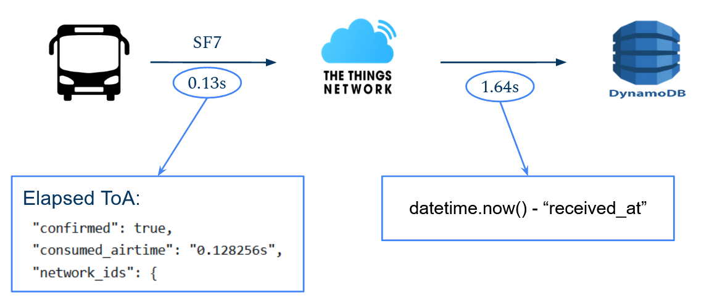
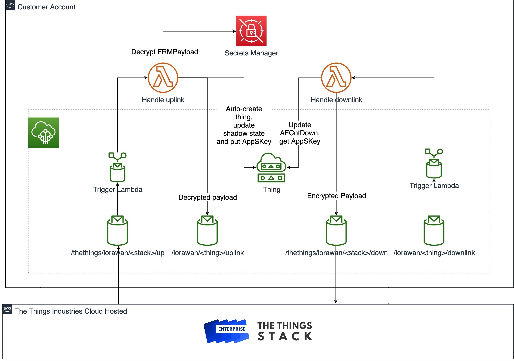

# Evaluation

## Requirements

- Interpretation of the collected data basedon some thresholds.
- The data have to be not older than 1 minute.
- Respect the LoRa DutyCylce constraint
- Guarantee security on the entire path.

## Indoor Parameters Levels

To have a better understing of the values collected by the sensors we had fixed some thresholds for each of the three parameters: Temperature, humidity and CO2 concentration. According to many studies the following values are the one considered ideal for the three parameters:

- Temperature: ideal range between 20 and 25 degree Celsius.
- Humidity: ideal range between 40 and 60 percent.
- CO2: ideal under 1100 ppm for idoor space.

    

We have collected CO2 concentration in three different bus and we ahve collected the most relevant values in the following table.

    

The concentration of CO2 inside the bus is the most of the time higher than 1100 ppm that according to our thresholds is the upper bound of the acceptable range. Only while stopped at the terminus with all the doors and windows opened we have registered a CO2 concentration on 600 ppm that is in the ideal range. We have understand, looking at our data, that the number of people inside the bus has a big impact on the CO2 concentration that is an expected behaviour since when we breathe out we produce CO2. Opening the windows and activating the air conditioning reduce the CO2 concentration but we were expecting a bigger impact of the air conditioning.

## Sampling Frequency

 The frequency with which our device can collect data and send them to the cloud is strictly related to the respect of the DutyCycle imposed by LoRa. In fact the LoRa specifications in Italy impose to respect a DutyCycle of 1%. Resepcting the DutyCycle of 1% means that if we need 0,1 seconds to send our data to the cloud then we need to wait for 9,9 seconds before to send fresh data.  
   In our case the data of transmission of the data is the Time on Air (ToA) of the LoRaWAN packets containing our data. The ToA corresponding to the time during which the channel is busy when sending a packet and it is strictly related to the Spreading Factor used to send the data. Given that the payload in our system is bigger than 60 bytes, according to the table on the right, we can use SF7, SF8 or SF9. As shown in the table as smaller the SF is, as higher is the data rate, but on the contrary smaller SF gives smaller range. We tested all those SF and we have tested the network statistics.  
   In order to collect the ToA for the different SF we have send messages with SF7, SF8 and SF9 and we have retrieved the ToA by looking at the metadata of the incoming packets on TTN. In partocular the ToA is in the metadata as "consumed_airtime".
All the three spreading factors are good in terms of packet loss, in fact we have not experienced packet loss but it may happend especially with SF9, and in terms of ToA.  In the table above are also shown the range per SF, and since our device will move into buses we may want to use SF9 to have the highest range possible.
Using SF9 means to have ToA of 0.41 seconds that means that respecting the 1% duty cycle we can sample each 41 seconds.
Since we have the requirements of have data not older than 1 minute we need to check the latency on the entire path device/frontend to be sure that the requiremt is satidfied.

## Network Delay

 The image on the right shows the overall architecture of our system. Looking at the architecture we can split our architecture overall delay in two delays: delay device/AWS and the delay AWS/front-end.  

 In order to find the delay device/AWS we can split it into two other delays: delay device/TTN + delay TTN/AWS. In the image on the right we have a schema of how measure those delays. In fact the delay device/AWS corresponds to the ToA of the LoRaWAN packet and we have seen in the previous paragraph that we can retrieve it looking at the packet's metadata. The delay TTN/AWS is a bit more treacky but not difficult. We can compute this delay inside the lambda function that is in charge of store the incoming TTN messages in the DynamoDB table. In particular we can retireve the time when the lambda receives the data, then we can find in the metadata the time when the packet arrives to the TTN application server under "received_at" and finally the delay is the difference of the two. This delay is quite variable infact we have seen a max of around 2.9 seconds and a min of 1.1 seconds, with a mean value of 1.64 seconds. 
Now we can find the delay device/AWS as ToA + delay TTN/AWS that in the worst case, using SF9 and considering the max TTN/AWS delay, is 3.31 seconds. 
The delay AWS/front-end clearly depends on the network speed, with a speed of about 85Mbps we have a delay less than 1.3 seconds.
Finally the worst overall delay, using SF9, is about 4.61 seconds.
Finally usign SF9 we can sample each 43 seconds and consider the delay of 4.61 seconds we are able to respect the constraint of having data not older than 1 minute.

## Security

To guarantee security over all the network we need to be sure that security is guaranteed on the following paths:

- ***Device/TTN***: In this path the data are exchanged through LoRaWAN that provides security in terms of integrity and confidentiality of the packets. In particular two keys are used: AppSKey to encrypt the payload and NwkSKey to compute the Message Integrity Code (MIC).
-  ***TTN/AWS***: The data are sent by TTN to AWS in a stack using MQTT protocol. MQTT does not provides strong security protocols but AWS can made the aws-ttn stack secure. When AWS creates the stack it generates a key, that key is sent to the Global Join Server operated by TTI (The Things Industries) and then it is used to encrypt the data on the stack.
- ***AWS/Front-end***: The front-end web page uses Htpps protocol so the security is guaranteed using TLS.

We have just seen that all the paths in the systems architechture are secure and so the security constraint is guaranteed.

# History
 
The previous version of the project: 
- <a href="https://github.com/FrancescoCrino/ConnectedBusMonitor/releases/tag/v1.0">ConnectedBusMonitor First Delivery</a>
- <a href="https://github.com/FrancescoCrino/ConnectedBusMonitor/releases/tag/v2.0">ConnectedBusMonitor Second Delivery</a>
