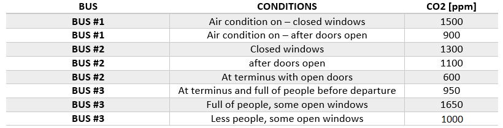

# Evaluation

With our bus monitoring system we want to fournish to the users all the information that can make the experience of taking a bus more relaxing and simple.
In particular we want to monitor not only the position of the bus in a near-real time way in order to gives to the user a correct information about the position of the bus but also make the user aware of the air quality inside the bus in term of CO2 quantity, temperature and humidity inside the bus.

For the evaluation of our system we want to focus on three of its main aspect: Indoor bus air quality monitoring, wireless communication constraints and costs.

We will not focus on the power consumption aspect, that normally is one of the most important aspect for an IoT system, since our bus monitor device will be connected with the bus grid.

# **Indoor bus air quality monitoring**

According to many researches high values of CO2 can reduce decision-making capabilities and increase mental stress.
The level of CO2 in offices has to be controlled and it is law regulated. In fact guidelines suggest CO2 levels do not exceed 700 ppm above outdoor levels, the ASHRAE action level. Some individuals are sensitive to CO2 levels as low as 600 ppm so action may even be warranted at lower levels.

Since in big cities like Rome, we can spend also 40 minutes in a bus, a too high concentration of CO2 inside the bus may affect our mental stress and also our healt.

We have did some tests in Rome monitoring the CO2 concentrations in different buses collecting values of CO2 in ppm in different conditions.

The prevoius table reports the mininum and maximum values recorded in three different buses taken in Rome during March/April 2022.

Furthermore the CO2 contentration in Rome open air is around 220 ppm so following the CO2 regulation for offices we may consider values less than 920 as good values.

We want to consider as indoor air quality indicators also the humidity and the temperature inside the vehicle.

A good range of humidity is 40%-60%, if we have a value of around 40% we are in a dry environment and with low temperature skin irritation and discomfort may occur.
On the contrary, if we have a humidity of around 60% we are in a humid enviroment that in case of high temperature can cause excessive sweating and altered temperature perception.

As regards the temperature the range 20°-25° is considered to be the ideal one.

We can resume the levels of our three bus indoor air quality indicator with the following graphs:

We can define 4 levels of air quality inside the bus:
- bad   🥵: all the indicators are not in the ideal range
- ok    😑: only one indicator is in the ideal range
- good  😊: two indicators are in the ideal range
- ideal 😄: all the indicators are in the ideal range

# **LoRa protocol constraints**

In order to send the collect data to the cloud we want to connect our bus monitor devices with a cloud service using LoRa network protocol.
In europe LoRa network procol regulate the duty cycle of the end devices to be less than 1% and obviously that has an impact on the time we need to wait between two meausre records.

The payload of the messages sent by the bus monitor devices are JSON string of the form {"humidity":"51.9", "temperature":"24.0","co2":319, "gps":"38.1405228,13.2872489"} and it has size 82 bytes.

For the moment we can simulate to send this kind of payload through [iot-lab](https://www.iot-lab.info/) that emulates a lora board sending the message to a lora device simulated in [TheThingNetwork](https://www.thethingsnetwork.org/)

The device simulated by TTN receives the LoRa packets containing our customize payload and we can look at the properties of the packet and in particular at the data-rate settings:

As we can see from the data-rate settings reported above our packet is sent using a bandwidth = 125kHz and SpreadingFactor = 7.

the table above contains all the LoRa bit-rate depending on bandwidth and SF used to send the packet, since we're transmitting with bw=125kHz and SF=7 we will have bit-rate=5.47kbps. 

So we can evaluate the time needed to send our packet: (82*8)/5470=0.120s.

Since we need 0.120s to send a packet and we have to respect 1% duty cycle constraint, we can transmit each 12 minutes.

# **Power consumption**

# **Costs**
Here we will examine and discuss wether putting this amount of energy and money into the proposed product worth it. (prices are found in local markets, they may differ for different places)
- STM32 Nucleo-F446ZE Board: about 25 euros
- GPS: GPS NEO 6M UBLOX: about 20 euros
- Accelerometer: Xtrinsic MMA8451Q 3-Axis: about 3 euros
- Infrared CO2 Sensor Module MH-Z19B: 30 euros
- Air quality sensor: 30 euros
- Gravity DHT11 Temperature Humidity Sensor: about 5 euros
- Dragino LoRa Shield: about 20 euros

# **Constraints**
In this section the constraints will be discussed. These can be categorzied in to the constraint of the network architecture (LoraWAN), constraints of components and the infrasructure.

# End-user 

Along doing this project, up to the second delivery different metrics will be used to measure and evaluate this device
