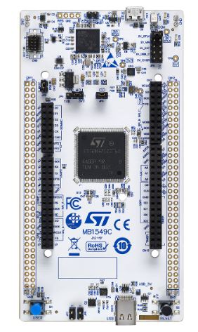
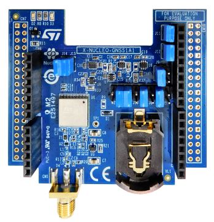
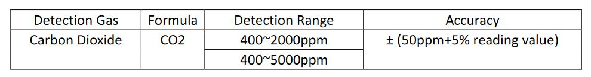
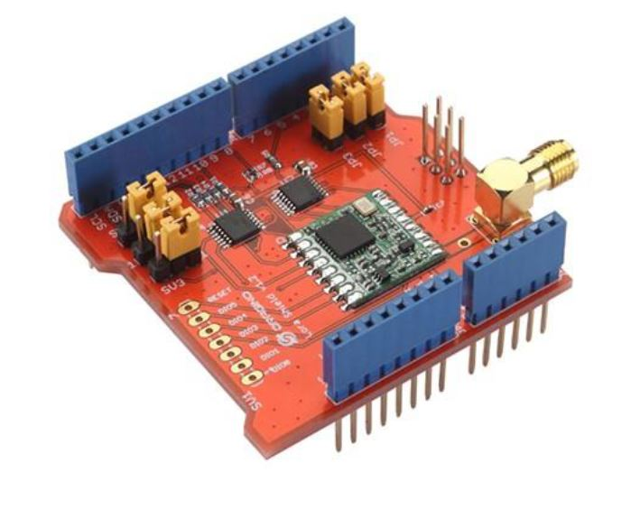
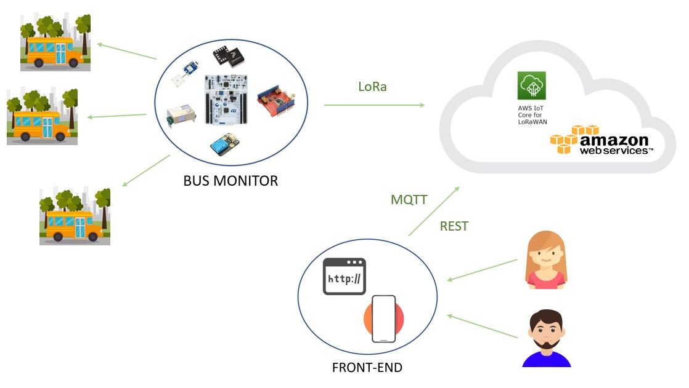

# TECHNOLOGY

## PROJECT MAIN PARTS:

- End-device
- Cloud + Front-End

## BUS MONITOR

The bus monitor is the device we want to use to monitor the bus collecting information about the quality of the air inside the bus and about the position of the bus. The core of this component is a STM32 Nucleo-F401RE board that runs RIOT operative systems. The Nucleo board is connected with four sensors: GPS, Accelerometer, Temperature-Humidity and CO2 sensor. The end-device is also equipped with a LoRa shield used to communicate with the gateway through LoRa communication protocol that allows a very good mobility thanks to its long range signal. Since the device will be positioned in a bus we can connect it to an energy source and so in this case we do not have strict constraints in terms of energy consumption.

## CLOUD + FRONT-END

To manage the collected data we will use the Amazon Web Services, AWS, utilities.
In particular our bus monitors will be connected with [AWS IoT Core for LoRaWAN](https://aws.amazon.com/it/iot-core/lorawan/) that is a fully managed LoRaWAN Network Server (LNS) that enables customers to connect wireless devices that use the LoRaWAN protocol.
In the cloud will be collected all the data collected by the bus monitor and those data can be accessed any time to obtain the information about the state of the bus.
The front-end of that project consists of a web page that access the data stored in the AWS cloud following a REST paradigm and provides to the user all the information about indoor state of the bus in terms of temperature, humidity and CO2 and the position of the bus in near real-time.

## BOARDS

### STM32 Nucleo-F446ZE

- Core:
  - Arm ® 32-bit Cortex ® M4 CPU with FPU
  - Adaptive real-time accelerator (ART Accelerator)  from Flash memory, frequency up to 180 MHz
  - MPU, 225 DMIPS/1.25 DMIPS/MHz

- Memories
  - 512 Kbytes of Flash memory
  - 128 Kbytes of SRAM
  - Flexible external memory controller with up
  - to 16-bit data bus: SRAM, PSRAM,
  - SDRAM/LPSDR SDRAM, NOR/NAND
  - Flash memories
  - Dual mode QuadSPI interface

- Datasheet: https://www.st.com/resource/en/datasheet/stm32f446ze.pdf

### STM32 Nucleo-F401RE

- Core: 
  - ARM ® 32-bit Cortex ® M4 CPU with FPU,  
  - Adaptive real-time accelerator (ART Accelerator™) allowing 0-wait state execution from Flash memory
  - frequency up to 84 MHz,
  - memory protection unit, 105 DMIPS/1.25DMIPS/MHz
- Memories
  - up to 512 Kbytes of Flash memory
  - up to 96 Kbytes of SRAM

- Datasheet: https://www.st.com/resource/en/datasheet/stm32f446ze.pdf

## SENSORS

### GPS: X-NUCLEO-GNSS1A1

Description:

The X-NUCLEO-GNSS1A1 expansion board is based on the Teseo-LIV3F tiny GNSS module.
It represents an affordable, easy-to-use, global navigation satellite system (GNSS) module, embedding a TeseoIII single die standalone positioning receiver IC, usable in different configurations in your STM32 Nucleo project.
The Teseo-LIV3F is a compact (9.7x10.1 mm) module that provides superior accuracy thanks to the on-board 26 MHz temperature compensated crystal oscillator (TCXO) and a reduced time-to-first fix (TTFF) with its dedicated 32 KHz real-time clock (RTC) oscillator.
The Teseo-LIV3F module runs the GNSS firmware (X-CUBE-GNSS1) to perform all GNSS operations including acquisition, tracking, navigation and data output without external memory support.
The X-NUCLEO-GNSS1A1 expansion board is compatible with the Arduino™ UNO R3 connector and the ST morpho connector, so it can be plugged to the STM32 Nucleo development board and stacked with additional STM32 Nucleo expansion boards.

Features:

- Operating supply voltage: 3.3 - 5 V
- Ambient temperature: -40/+85 °C
- Sensitivity: -162 dBm indoor (tracking mode)
- Interfaces:
  - a UART port
  - an I²C port
  - Configurable digital I/O timepulse
  - EXTINT input for wakeup
- NMEA protocol
- Assisted GNSS:
  - Predictive autonomous
  - Predictive server-based
  - Real-time server-based
- Compatible with STM32 Nucleo boards
- Compatible with the Arduino™ UNO R3 connector
- LNA and SAW filter on the RF path
- SMA female antenna connector
- Battery holder
- RoHS and WEEE compliant

Datasheet:

https://www.st.com/en/ecosystems/x-nucleo-gnss1a1.html#overview

### ACCELEROMETER, TEMPERATURE and HUMIDITY SENSOR: X-NUCLEO-IKS01A2

Description:

The X-NUCLEO-IKS01A2 is a motion MEMS andenvironmental sensor expansion board for the STM32 Nucleo.
It is equipped with Arduino UNO R3 connector layout, and is designed around the LSM6DSL 3D accelerometer and 3D gyroscope, the LSM303AGR 3D accelerometer and 3D magnetometer, the HTS221 humidity and temperature sensor and the LPS22HB pressure sensor.
The X-NUCLEO-IKS01A2 interfaces with the STM32 microcontroller via the I²C pin, and it is possible to change the default I²C port.

Features:

- LSM6DSL MEMS 3D accelerometer
(±2/±4/±8/±16 g) and 3D gyroscope
(±125/±245/±500/±1000/±2000 dps)
-  LSM303AGR MEMS 3D accelerometer
(±2/±4/±8/±16 g) and MEMS3D
magnetometer (±50 gauss)
- LPS22HB MEMS pressure sensor, 260-
1260 hPa absolute digital output barometer
- HTS221: capacitive digital relative humidity
and temperature
- DIL24 socket for additional MEMS adapters
and other sensors
- Free comprehensive development firmware
library and example for all sensors
compatible with STM32Cube firmware
- I²C sensor hub features on LSM6DSL
available
- Compatible with STM32 Nucleo boards
- Equipped with Arduino UNO R3 connector
- RoHS compliant

Datasheet:

https://www.st.com/en/ecosystems/x-nucleo-iks01a2.html#overview

### CO2 SENSOR: MH-Z19C

Description:

MH-Z19C NDIR infrared gas module is a common type, small size sensor, using non-dispersive infrared (NDIR) principle to detect the existence of CO2 in the air, with good selectivity, non-oxygen dependent and long life. Built-in temperature compensation; and it has UART output and PWM output. 
It is developed by the tight integration of mature infrared absorbing gas detection technology, precision optical circuit design and superior circuit design.

Features:

- Chamber is gold plated, water-proof and anti-corrosion
- High sensitivity, low power consumption
- Good stability
- Temperature compensation, excellent linear output
- Multiple output modes: UART, PWM
- Long lifespan
- Anti-water vapor interference, anti-poisonin

Datasheet:

https://www.winsen-sensor.com/d/files/infrared-gas-sensor/mh-z19c-pins-type-co2-manual-ver1_0.pdf

Detection range and accuracy

Main parameters

## CONNECTIVITY

### LoRa MODULE**: Dragino LoRa Shield - support 868M frequency

Features:

- Compatible with 3.3v or 5v I/O Arduino Board.
- Frequency Band: 868 MHZ
- Low power consumption
- Compatible with Arduino Leonardo, Uno, Mega, DUE
- External Antenna via I-Pex connector

Specifications:

- 168dB maximum link budget.
- +20dBm - 100mW constant RF output vs.
- +14dBm high efficiency PA.
- Programmable bit rate up to 300 kbps.
- High sensitivity: down to -148dBm.
- Bullet-proof front end: IIP3 = -12.5dBm.
- Excellent blocking immunity.
- Low RX current of 10.3mA, 200nA register retention.
- Fully integrated synthesizer with a resolution of 61 Hz.
- FSK, GFSK, MSK, GMSK, LoRa™ and OOK modulation.
- Built-in bit synchronizer for clock recovery.
- Preamble detection.
- 127 dB Dynamic Range RSSI.
- Automatic RF Sense and CAD with ultra-fast AFC.
- Packet engine up to 256 bytes with CRC.
- Built-in temperature sensor and low battery indicator

Datsheet: https://www.farnell.com/datasheets/2630874.pdf

## ARCHITECTURE STRUCTURE:

