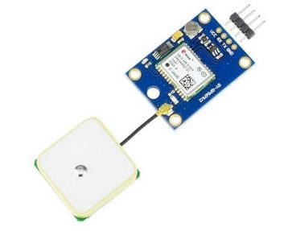
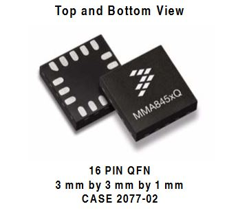
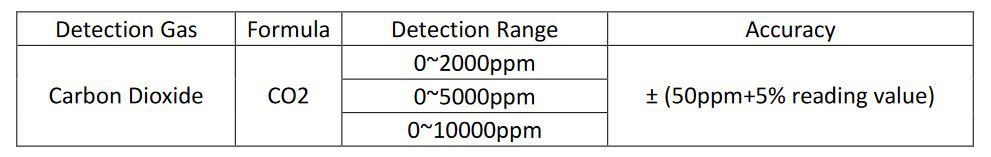
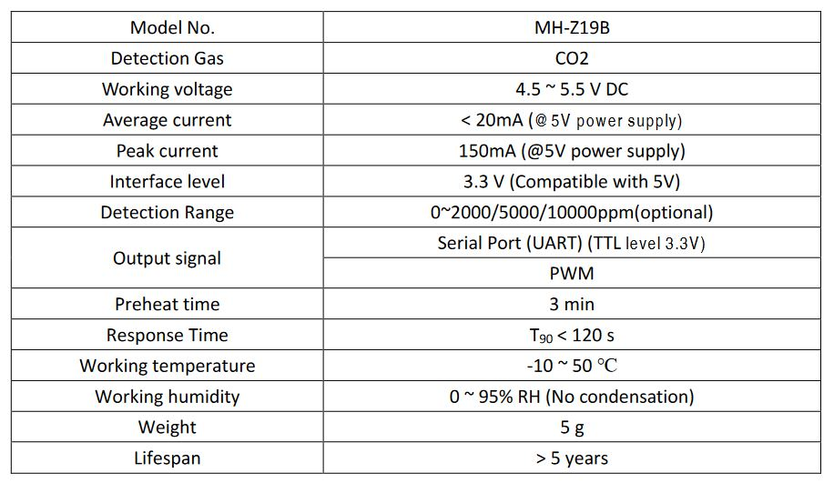
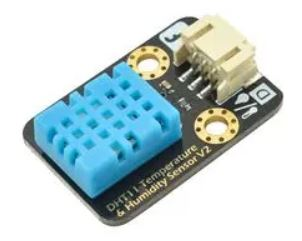
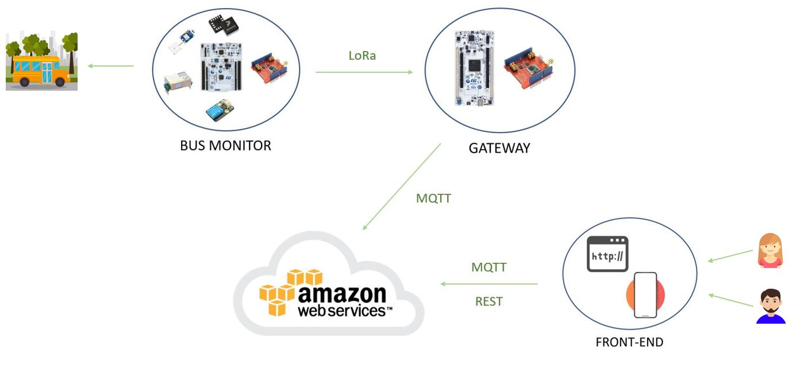

**TECHNOLOGY**

PROJECT MAIN PARTS:

- End-device
- Gateway
- Cloud + Front-End

**BUS MONITOR:**

The bus monitor is the device we want to use to monitor the bus collecting information about the quality of the air inside the bus and about the position of the bus. The core of this component is a STM32 Nucleo-F401RE board that runs RIOT operative systems. The Nucleo board is connected with four sensors: GPS, Accelerometer, Temperature-Humidity and CO2 sensor. The end-device is also equipped with a LoRa shield used to communicate with the gateway through LoRa communication protocol that allows a very good mobility thanks to its long range signal. Since the device will be positioned in a bus we can connect it to an energy source and so in this case we do not have strict constraints in terms of energy consumption.

**GATEWAY:**

All the End-devices are connected with a gateway.
Our gateway is composed of a Nucleo board STM32 Nucleo-F446ZE and a LoRa shield that allows the gateway to communicate with the end-devices through the LoRa communication protocol. 
The gateway receives all the information collected from the end-devices and forwards them to the AWS cloud.
The gateway communicates with the AWS cloud via MQTT.

**CLOUD + FRONT-END:**

To manage the collected data we will use the Amazon Web Services, AWS, utilities.
The front-end of that project consists of a web page or a mobile application (maybe both) that access the data stored in the AWS cloud following a REST paradigm.
The front-end part needs to focus on the end-user experience giving correct information in short time and having a user-friendly interface. 

**BOARDS**

**STM32 Nucleo-F446ZE**

- Core:
  - Arm ® 32-bit Cortex ® M4 CPU with FPU
  - Adaptive real-time accelerator (ART Accelerator)  from Flash memory, frequency up to 180 MHz
  - MPU, 225 DMIPS/1.25 DMIPS/MHz

- Memories
  - 512 Kbytes of Flash memory
  - 128 Kbytes of SRAM
  - Flexible external memory controller with up
  - to 16-bit data bus: SRAM, PSRAM,
  - SDRAM/LPSDR SDRAM, NOR/NAND
  - Flash memories
  - Dual mode QuadSPI interface

- Datasheet: https://www.st.com/resource/en/datasheet/stm32f446ze.pdf

**STM32 Nucleo-F401RE**

- Core: 
  - ARM ® 32-bit Cortex ® M4 CPU with FPU,  
  - Adaptive real-time accelerator (ART Accelerator™) allowing 0-wait state execution from Flash memory
  - frequency up to 84 MHz,
  - memory protection unit, 105 DMIPS/1.25DMIPS/MHz
- Memories
  - up to 512 Kbytes of Flash memory
  - up to 96 Kbytes of SRAM

- Datasheet: https://www.st.com/resource/en/datasheet/stm32f446ze.pdf

**SENSORS:**

**GPS**: GPS NEO 6M UBLOX

Features:

- Supply from 3Vcc to 5Vcc
- 50 channels receiver
- Battery for data backup
- Refresh frequency: 5Hz
- Serial output 9600 Baud, 8 bit, 1 bit stop 
- Data output NMEA
- Dimensioni: 30mm x 23mm x 4mm
- Dimensioni antenna: 25mm x 25mm x 8mm

Datasheet:

https://homotix\_it.e-mind.it/upld/repository/File/neo-6\_datasheet\_(gps.g6-hw-09005).pdf

**ACCELEROMETER**: Xtrinsic MMA8451Q 3-Axis

Features:

- 1.95V to 3.6V supply voltage
- 1.6V to 3.6V interface voltage
- ±2g/±4g/±8g dynamically selectable full-scale
- Output Data Rates (ODR) from 1.56 Hz to 800 Hz
- 99 μg/√Hz noise
- 14-bit and 8-bit digital output
- I2 C digital output interface (operates to 2.25 MHz with 4.7 kΩ pullup)
- Two programmable interrupt pins for seven interrupt sources
- Three embedded channels of motion detection
- Freefall or Motion Detection: 1 channel
- Pulse Detection: 1 channel
- Jolt Detection: 1 channel
- Orientation (Portrait/Landscape) detection with programmable hysteresis
- Automatic ODR change for Auto-WAKE and return to SLEEP
- 32-sample FIFO
- High-Pass Filter Data available per sample and through the FIFO
- Self-Test
- RoHS compliant
- Current Consumption: 6 μA to 165 μA

Datasheet:

<https://cdn-shop.adafruit.com/datasheets/MMA8451Q-1.pdf>

**AIR QUALITY SENSOR**: Infrared CO2 Sensor Module MH-Z19B

Features:

- Chamber is gold plated, water-proof and anti-corrosion
- High sensitivity, low power consumption
- Good stability
- Temperature compensation, excellent linear output
- Multiple output modes: UART, PWM
- Long lifespan
- Anti-water vapor interference, anti-poisonin

Datasheet:

https://www.winsen-sensor.com/d/files/infrared-gas-sensor/ndir-co2-sensor/mh-z19b-co2-manual(ver1\_6).pdf

Detection range and accuracy

Main parameters

**TEMPERATURE & HUMIDITY SENSOR**: Gravity DHT11 Temperature Humidity Sensor

Features:

- Standard assembling structure ( two 3mm holes with multiple of 5cm as interval ).
- User-friendly interfaces ( "A" for analog and "D" for digital ). 
- Icons to simply illustrate sensor function.
- High quality connector.
- Immersion gold surface.

Specification:

- Wider voltage range: 3.3V to 5V
- Temperature range :0-50 °C error of ± 2 °C
- Humidity :20-90% RH ± 5% RH error
- Interface: Digital

Datsheet: https://www.farnell.com/datasheets/2700138.pdf

**CONNECTIVITY:**

**LoRa MODULE**: Dragino LoRa Shield - support 868M frequency

Features:

- Compatible with 3.3v or 5v I/O Arduino Board.
- Frequency Band: 868 MHZ
- Low power consumption
- Compatible with Arduino Leonardo, Uno, Mega, DUE
- External Antenna via I-Pex connector

Specifications:

- 168dB maximum link budget.
- +20dBm - 100mW constant RF output vs.
- +14dBm high efficiency PA.
- Programmable bit rate up to 300 kbps.
- High sensitivity: down to -148dBm.
- Bullet-proof front end: IIP3 = -12.5dBm.
- Excellent blocking immunity.
- Low RX current of 10.3mA, 200nA register retention.
- Fully integrated synthesizer with a resolution of 61 Hz.
- FSK, GFSK, MSK, GMSK, LoRa™ and OOK modulation.
- Built-in bit synchronizer for clock recovery.
- Preamble detection.
- 127 dB Dynamic Range RSSI.
- Automatic RF Sense and CAD with ultra-fast AFC.
- Packet engine up to 256 bytes with CRC.
- Built-in temperature sensor and low battery indicator

Datsheet: https://www.farnell.com/datasheets/2630874.pdf

**ARCHITECTURE:**

