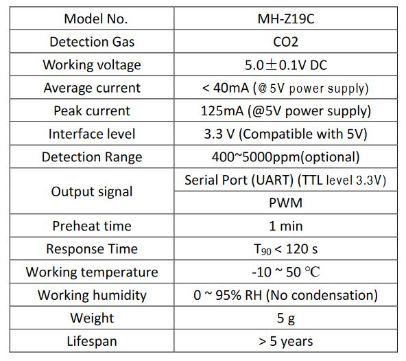

# TECHNOLOGY

In this section all the technology aspects of our project are described. <\br>
At first we will look in detail all the hardware components used to build our device, then we will have a look at the overall architecture and then we will see how the cloud part is managed.

## OVERALL ARCHITECHTURE:

--> Immagine dell'architettura

The architecture of our system is the one shown in the image above.
It is composed of 4 main parts:
- ***Physical Device***: Is the physical device that is placed inside the bus to monitor the indoor environment. It collects data about temperature, humidity and co2 inside the bus and sends the data to the TTN application server.
- ***TheThingNetwork (TTN)***: We use TTN as LoRaWAN application server. It receives all the data collected by the physical device and forward them to AWS where they are stored and made available for the front-end.
- ***AmazonWebServices***: To build our cloud services we have used Amazon Web Service AWS. Here the data forwarded by the TTN application server are received using an MQTT stack, then they are stored in a DynamoDB table and finally exposed to the front-end through rest api.
- **Front-End**: Is a web site developend with [Angular](https://angular.io/) that shows all the available buses and for each them shows the indoor environment data.

In the rest of this documment we will see all the previous components more in detail.

## Physical Device

The physical device developed is composed of three hardware components:
- The borad B-L072Z-LRWAN1: Is a STM32 LoRaWAN discovery board that is the main board of our device. Its role is to collect the data from the sensors, format them in a json string and send the message to the cloud using LoRa protocol.
- X-NUCLEO-IKS01A2: is a motion MEMS and environmental sensor expansion board for the STM32 Nucleo. It is a very interesting expansion board since it has all the most important sensors to monitor the environment. Furthermore it is equipped with Arduino UNO R3 connector layout so that we can plug it on top of the B-L072Z-LRWAN1 board.
- MH-Z19C: It is an infrared CO2 sensor using non-dispersive infrared (NDIR) principle to detect the existence of CO2 in the air, with good selectivity, non-oxygen dependent and long life. 

Let's see all those hardware components more in details:

### B-L072Z-LRWAN1: STM32 LoRa Discovery Board

***Technical description***: 

The B-L072Z-LRWAN1 LoRa®/Sigfox™ Discovery kit is a development tool to learn and develop solutions based on LoRa®, Sigfox™, and FSK/OOK technologies The module is powered by an STM32L072CZ microcontroller and SX1276 transceiver. The transceiver features the LoRa® long-range modem, providing ultra-long-range spread-spectrum communication and high interference immunity, minimizing current consumption.The B-L072Z-LRWAN1 Discovery kit includes an ST-LINK/V2-1 embedded debug tool interface, LEDs, push-buttons, antenna, Arduino™ Uno V3 connectors and USB OTG connector in Micro-B format.
The LoRaWAN™ stack supports Class A, Class B, and Class C.

***Features:***
- CMWX1ZZABZ-091 LoRa®/Sigfox™ module (Murata)
  - Embedded ultra-low-power STM32L072CZ MCU, based on Arm® Cortex®-M0+ core, with 192 Kbytes of Flash memory, 20 Kbytes of RAM, 20 Kbytes of EEPROM
  - Frequency range: 860 MHz - 930 MHz
  - 4-channel,12-bit ADC, 2 × DAC
  - 6-bit timers, LP-UART, I2C and SPI
  - Embedded SX1276 transceiver
  - LoRa®, FSK, GFSK, MSK, GMSK, and OOK modulations (+ Sigfox™ compatibility)
  -  Programmable bit rate up to 300 kbit/s
  - 127 dB+ dynamic range RSSI
  - LoRaWAN™ Class A certified
- Arduino™ Uno V3 connectors
- Board power supply through the USB bus or external VIN/3.3 V supply voltage or batteries 

***Datasheet***: https://www.st.com/resource/en/user_manual/um2115-discovery-kit-for-lorawan-sigfox-and-lpwan-protocols-with-stm32l0-stmicroelectronics.pdf

### X-NUCLEO-IKS01A2: Motion sensor 

***Technical description***:

  
The X-NUCLEO-IKS01A2 is a motion MEMS and environmental sensor expansion board for the STM32 Nucleo.
It is equipped with Arduino UNO R3 connector layout, and is designed around the LSM6DSL 3D accelerometer and 3D gyroscope, the LSM303AGR 3D accelerometer and 3D magnetometer, the HTS221 humidity and temperature sensor and the LPS22HB pressure sensor.
The X-NUCLEO-IKS01A2 interfaces with the STM32 microcontroller via the I²C pin, and it is possible to change the default I²C port.

***Features:***

- LSM6DSL MEMS 3D accelerometer
(±2/±4/±8/±16 g) and 3D gyroscope
(±125/±245/±500/±1000/±2000 dps)
-  LSM303AGR MEMS 3D accelerometer
(±2/±4/±8/±16 g) and MEMS3D
magnetometer (±50 gauss)
- LPS22HB MEMS pressure sensor, 260-
1260 hPa absolute digital output barometer
- HTS221: capacitive digital relative humidity
and temperature
- DIL24 socket for additional MEMS adapters
and other sensors
- Free comprehensive development firmware
library and example for all sensors
compatible with STM32Cube firmware
- I²C sensor hub features on LSM6DSL
available
- Compatible with STM32 Nucleo boards
- Equipped with Arduino UNO R3 connector
- RoHS compliant

***Datasheet***: https://www.st.com/en/ecosystems/x-nucleo-iks01a2.html#overview

### CO2 SENSOR: MH-Z19C

***Technical description***:

  
MH-Z19C NDIR infrared gas module is a common type, small size sensor, using non-dispersive infrared (NDIR) principle to detect the existence of CO2 in the air, with good selectivity, non-oxygen dependent and long life. Built-in temperature compensation; and it has UART output and PWM output. 
It is developed by the tight integration of mature infrared absorbing gas detection technology, precision optical circuit design and superior circuit design.

***Features:*** 

  

- Chamber is gold plated, water-proof and anti-corrosion
- High sensitivity, low power consumption
- Good stability
- Temperature compensation, excellent linear output
- Multiple output modes: UART, PWM
- Long lifespan
- Anti-water vapor interference, anti-poisonin 
 

***Datasheet***: https://www.winsen-sensor.com/d/files/infrared-gas-sensor/mh-z19c-pins-type-co2-manual-ver1_0.pdf  

## CLOUD 

--> Inserire immagine Cloud

The image above shows the architecture of the cloud part of our project.
Our cloud architecture uses the following AWS services:
-***AWS IoT-Core***: Is the MQTT broker that receives the data coming from TTN in the specific aws-ttn stack. It receives the data on the topic *lorawan/$devID/uplink* and calls the lambda function *cbm-table-store* that formats the data and store them in a DynamoDB table called *cbm_table*.
-***AWS DynamoDb***: To store the data collected by the physical device we use a DynamoDB table. All the incoming data are stored in *cbm_table* that is a dynamoDB table having four columns:
  - timestamp: Is the key of the table and corresponds to the timestamp of the moment when the data are stored
  - bus: number of the bus where we are collecting the data
  - date: Date when the data are stored 
  - payload: Contains a JSON string containing the values of temperature,humidity and co2 collected
-***AWS API-Gateway***: Thanks to this service we made the data available through REST API. We have two endpoints "/bus" and "bus/id". In both cases the API Gateway calls the lambda function *cbm-getItem* that parse the endpoint and sends back the response to the API request.
-***Lambda Functions***: With this utility we can build lambda functions to manage our data. We have developed two lambda functions:
  - cbm-getItem: Invoked by the API Gateway when an API request is received, it computes the responses of the corresponding request:
    - /bus: Returns the IDs of all the available buses in the database
    - /bus/id: Returns the 20 most recent entries with bus=id.
  - cbm-table-store: Receives the data received on aws-ttn stack. Reads the data, formats them and stores them in the dynamoDB table. To formatting the data it computes:
    - Storage data
    - timestamp relative to storage data
    - extracts the bus id from the data and puts it in the specific column
-***AWS CodeCommit***: AWS CodeCommit is a secure, highly scalable, managed source control service that hosts private Git repositories. In our case we use it to store the static files of our websites.
-***AWS Amplify***: Is an AWS service that we use to deploy our web-site. In particular we connect it to the CodeCommit folder, it intreprets the static files and deploy the website.

## FRONT-END

To manage the collected data we will use the Amazon Web Services, AWS, utilities.
In particular our bus monitors will be connected with [AWS IoT Core for LoRaWAN](https://aws.amazon.com/it/iot-core/lorawan/) that is a fully managed LoRaWAN Network Server (LNS) that enables customers to connect wireless devices that use the LoRaWAN protocol.
In the cloud will be collected all the data collected by the bus monitor and those data can be accessed any time to obtain the information about the state of the bus.
The front-end of that project consists of a web page that access the data stored in the AWS cloud following a REST paradigm and provides to the user all the information about indoor state of the bus in terms of temperature, humidity and CO2 and the position of the bus in near real-time.

# History
 
The previous version of the project: <a href="https://github.com/FrancescoCrino/ConnectedBusMonitor/releases/tag/v1.0">ConnectedBusMonitor First Delivery</a>

